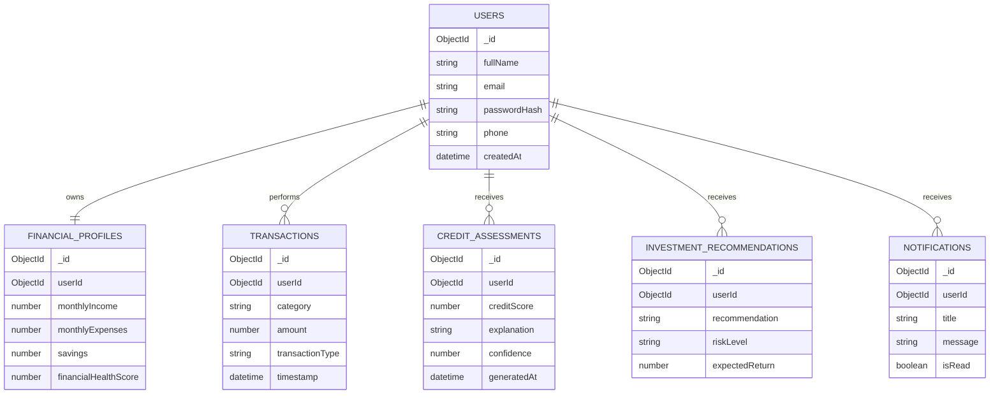

<div align="center">

# CreditMiners

### Where Financial Potential Meets Opportunity

An AI-powered financial intelligence platform that leverages Explainable Artificial Intelligence (XAI) to deliver transparent credit assessment, personalized financial insights, and intelligent micro-investment recommendations.

---


</div>

---

## Overview

CreditMiners is an AI-powered financial intelligence platform designed to improve financial inclusion by providing transparent, explainable, and data-driven credit assessments for individuals who are traditionally underserved by conventional financial systems.

Unlike traditional credit scoring systems that primarily rely on historical borrowing records, CreditMiners evaluates alternative financial indicators, spending behavior, savings consistency, digital payment activity, and financial discipline to generate an explainable Financial Health Score.

The platform combines Explainable Artificial Intelligence (XAI), financial analytics, and personalized recommendations to help users understand their financial standing, improve creditworthiness, and make informed investment decisions.

Rather than functioning solely as a credit scoring application, CreditMiners acts as a comprehensive financial guidance platform that empowers users to build sustainable financial habits while maintaining complete transparency in every AI-generated decision.

---

## Key Highlights

- Explainable AI-powered credit intelligence
- Financial Health Score based on alternative financial indicators
- Personalized financial improvement roadmap
- AI-driven micro-investment recommendations
- Transparent decision-making with explainable insights
- Secure, privacy-focused architecture
- Designed to promote financial inclusion for underserved communities

---

## Why CreditMiners?

Traditional financial systems often fail to serve individuals with limited or no formal credit history, despite responsible financial behavior.

Students, freelancers, gig workers, self-employed professionals, and first-time earners frequently face challenges when applying for loans, financial products, or investment services because conventional credit evaluation methods lack contextual understanding.

CreditMiners addresses this limitation by transforming everyday financial behavior into meaningful financial intelligence through transparent AI models and explainable recommendations, enabling users to build stronger financial profiles with confidence.

---

> **Mission**
>
> Democratize access to financial opportunities through transparent, explainable, and intelligent financial assessment.


<!-- ========================================================================= -->
<!-- SECTION 02 : TABLE OF CONTENTS -->
<!-- ========================================================================= -->

## Table of Contents

- [Overview](#overview)
- [Key Highlights](#key-highlights)
- [Why CreditMiners?](#why-creditminers)
- [Project Overview](#project-overview)
- [Problem Statement](#problem-statement)
- [Objectives](#objectives)
- [Core Features](#core-features)
- [System Architecture](#system-architecture)
- [Technology Stack](#technology-stack)
- [Project Structure](#project-structure)
- [Database Design](#database-design)
- [Application Workflow](#application-workflow)
- [AI Pipeline](#ai-pipeline)
- [API Documentation](#api-documentation)
- [Authentication & Authorization](#authentication--authorization)
- [Security Considerations](#security-considerations)
- [Installation](#installation)
- [Environment Variables](#environment-variables)
- [Running the Application](#running-the-application)
- [Testing](#testing)
- [Deployment](#deployment)
- [Performance & Scalability](#performance--scalability)
- [Future Roadmap](#future-roadmap)
- [Contributing](#contributing)
- [License](#license)
- [Acknowledgements](#acknowledgements)

---

<!-- ========================================================================= -->
<!-- SECTION 03 : PROJECT OVERVIEW -->
<!-- ========================================================================= -->

## Project Overview

CreditMiners is an AI-powered financial intelligence platform that enables transparent, explainable, and data-driven financial decision-making for individuals who are often overlooked by traditional credit evaluation systems.

The platform combines Explainable Artificial Intelligence (XAI), financial analytics, and intelligent recommendation systems to assess a user's financial behaviour beyond conventional credit history. Rather than assigning a numerical score without context, CreditMiners explains *why* a score was generated, identifies the factors influencing it, and provides personalized recommendations to improve financial health over time.

The project is designed around three fundamental principles:

- **Transparency** – Every AI-generated decision is accompanied by an understandable explanation.
- **Financial Inclusion** – Alternative financial indicators help evaluate users with limited or no formal credit history.
- **Actionable Intelligence** – Users receive practical recommendations to improve their financial profile and investment readiness.

CreditMiners is intended to serve as a financial intelligence platform rather than a traditional credit scoring application. By combining explainable AI with responsible financial analytics, the platform empowers users to make informed financial decisions while fostering trust in AI-driven systems.

---

<!-- ========================================================================= -->
<!-- SECTION 04 : PROBLEM STATEMENT -->
<!-- ========================================================================= -->

## Problem Statement

Conventional credit assessment systems primarily depend on historical borrowing records, repayment history, and financial products already owned by an individual. While effective for established borrowers, this approach creates a significant barrier for millions of users who actively participate in the digital economy but lack a formal credit history.

Students, freelancers, gig workers, self-employed professionals, and first-time earners frequently experience reduced access to loans, financial services, and investment opportunities despite demonstrating responsible financial behaviour.

The challenges associated with existing credit evaluation systems include:

- Heavy dependence on historical credit records.
- Limited transparency in score generation.
- Lack of personalized guidance for improving financial health.
- Minimal consideration of alternative financial behaviour.
- Low accessibility for financially underserved populations.

As digital payment adoption continues to increase, there is an opportunity to leverage alternative financial indicators and Explainable Artificial Intelligence to create a more transparent, inclusive, and user-centric financial assessment framework.

---

<!-- ========================================================================= -->
<!-- SECTION 05 : OBJECTIVES -->
<!-- ========================================================================= -->

## Objectives

The primary objective of CreditMiners is to build an intelligent financial assessment platform that promotes financial inclusion while maintaining transparency, fairness, and explainability throughout the decision-making process.

The platform aims to:

- Develop an explainable AI-based financial assessment model.
- Generate a comprehensive Financial Health Score using alternative financial indicators.
- Improve accessibility to financial opportunities for underserved users.
- Provide personalized recommendations for improving financial behaviour.
- Encourage responsible investment through AI-assisted micro-investment guidance.
- Promote trust in AI-driven financial decision-making through explainable insights.
- Deliver a secure, privacy-conscious, and scalable financial intelligence platform.

<!-- ========================================================================= -->
<!-- SECTION 06 : CORE FEATURES -->
<!-- ========================================================================= -->

# Core Features

CreditMiners combines financial analytics, explainable artificial intelligence, and personalized financial guidance into a unified platform. Each feature has been designed to improve financial awareness while maintaining transparency, security, and accessibility.

---

## Explainable Credit Intelligence

Unlike conventional credit scoring systems that provide only a numerical value, CreditMiners explains the reasoning behind every generated score.

The AI model evaluates multiple financial indicators and identifies the factors that positively or negatively influence a user's financial profile. Every recommendation is accompanied by an explanation, enabling users to understand how specific financial behaviours affect their overall assessment.

**Highlights**

- Explainable AI (XAI) based scoring
- Transparent decision rationale
- Feature importance visualization
- Credit improvement suggestions
- Confidence-based predictions

---

## Financial Health Score

The Financial Health Score provides a comprehensive assessment of an individual's financial well-being by considering multiple behavioural and transactional indicators instead of relying exclusively on historical credit records.

The score continuously adapts as new financial data becomes available, allowing users to monitor their financial progress over time.

**Assessment Parameters**

- Spending consistency
- Savings behaviour
- Income stability
- Digital payment activity
- Financial discipline
- Budget adherence
- Transaction frequency

---

## AI Financial Readiness Assessment

CreditMiners evaluates whether a user is financially prepared for products such as personal loans, credit cards, investment plans, or other financial services.

Rather than issuing a binary approval or rejection, the platform highlights areas that require improvement and provides actionable recommendations.

**Capabilities**

- Readiness prediction
- Risk evaluation
- Behavioural analysis
- Financial recommendations
- Personalized improvement roadmap

---

## AI Investment Advisor

The platform assists users in making informed investment decisions by analysing financial behaviour, investment goals, and individual risk tolerance.

Recommendations are generated using AI models while maintaining complete transparency regarding the reasoning behind each suggestion.

**Recommendations Include**

- SIP suggestions
- Micro-investment opportunities
- Goal-based investment planning
- Risk profile assessment
- Portfolio diversification guidance

---

## Personalized Financial Insights

CreditMiners continuously analyses financial activities and delivers personalized insights to encourage healthier financial habits.

The recommendation engine identifies opportunities for improvement while providing measurable objectives that users can track over time.

Examples include:

- Reduce discretionary spending
- Improve monthly savings ratio
- Increase emergency fund coverage
- Maintain consistent transaction behaviour
- Improve financial stability indicators

---

## Analytics Dashboard

The platform presents financial information through an intuitive dashboard that enables users to understand their financial position without requiring technical knowledge.

The dashboard includes visual analytics, historical trends, and AI-generated insights.

**Dashboard Components**

- Financial Health Score
- Credit Intelligence Summary
- Spending Analytics
- Savings Trends
- Investment Recommendations
- Financial Goals Progress
- Monthly Performance Reports

---

## Privacy and Security

Financial information is handled using industry-standard security practices to ensure confidentiality, integrity, and user control.

CreditMiners follows a privacy-first architecture where users explicitly control the data used for financial assessment.

**Security Measures**

- End-to-end encryption
- JWT-based authentication
- Role-based authorization
- Secure API communication
- Consent-based data access
- Protected financial records
- Secure credential management

---

## Responsible Artificial Intelligence

Transparency and fairness are fundamental principles of the platform.

CreditMiners follows Responsible AI practices by ensuring that AI-generated decisions remain explainable, interpretable, and auditable.

The platform is designed to minimize bias while providing users with meaningful explanations rather than opaque predictions.

**Responsible AI Principles**

- Explainability
- Transparency
- Fairness
- Privacy
- Accountability
- Human-centered recommendations
- Continuous model evaluation

<!-- ========================================================================= -->
<!-- SECTION 07 : SYSTEM ARCHITECTURE -->
<!-- ========================================================================= -->

# System Architecture

CreditMiners follows a modular, service-oriented architecture designed for scalability, maintainability, and separation of concerns. Each layer of the application has a clearly defined responsibility, enabling independent development, testing, and deployment.

The system consists of five primary layers:

1. Presentation Layer
2. Application Layer
3. AI & Analytics Layer
4. Data Layer
5. External Services Layer

The following diagram illustrates the high-level architecture.


---

## Architectural Principles

The architecture has been designed around the following engineering principles.

### Separation of Concerns

Each module is responsible for a single business capability. Business logic, AI processing, authentication, and data persistence remain isolated, reducing coupling between components.

---

### Scalability

The backend services are designed so they can be independently scaled as application traffic grows. Compute-intensive AI operations remain isolated from the core API layer.

---

### Maintainability

The project follows a modular folder structure, allowing new services and features to be integrated without affecting existing functionality.

---

### Security

Sensitive financial data is processed only through authenticated APIs. User information remains encrypted during transmission and storage, while authentication and authorization are handled independently of business logic.

---

### Explainability

Unlike conventional AI systems, every financial recommendation generated by CreditMiners is accompanied by an explanation that identifies the primary contributing factors behind the prediction.

---

## Data Flow

The application follows the following request lifecycle.

```text
User

   │

   ▼

React Frontend

   │

   ▼

REST API

   │

   ▼

Business Services

   │

   ▼

AI Decision Engine

   │

   ▼

Database + External APIs

   │

   ▼

Explainable Response

   │

   ▼

Frontend Dashboard
```

---

## Design Goals

The architecture is designed to achieve the following objectives.

- Modular service-oriented design
- Independent AI processing layer
- Low coupling between modules
- High maintainability
- Secure financial data handling
- Explainable AI integration
- Production-ready deployment architecture
- Future extensibility for additional financial services

<!-- ========================================================================= -->
<!-- SECTION 08 : TECHNOLOGY STACK -->
<!-- ========================================================================= -->

# Technology Stack

CreditMiners is built using a modern, modular technology stack selected for scalability, maintainability, security, and rapid development. Each technology has been chosen based on its suitability for building AI-enabled financial applications.

---

## Technology Overview

| Layer | Technology | Purpose |
| :----- | :--------- | :------ |
| Frontend | React.js | User Interface |
| Styling | Tailwind CSS | Responsive UI Development |
| Backend | Node.js | Server Runtime |
| Framework | Express.js | REST API Development |
| Database | MongoDB | Data Persistence |
| AI / ML | Python | Model Development & Inference |
| AI Libraries | Scikit-learn, Pandas, NumPy | Data Analysis & Prediction |
| Authentication | JWT | Secure User Authentication |
| Password Security | bcrypt | Password Hashing |
| API Testing | Postman | API Validation |
| Version Control | Git | Source Code Management |
| Repository | GitHub | Collaboration & Version Control |
| Deployment | Vercel / Render | Frontend & Backend Hosting |

---

## Frontend

The frontend is responsible for delivering a responsive and intuitive user experience while presenting financial insights in a clear and accessible manner.

| Technology | Description |
| :--------- | :---------- |
| React.js | Component-based frontend library for building dynamic interfaces |
| Tailwind CSS | Utility-first CSS framework for responsive layouts |
| React Router | Client-side routing and navigation |
| Axios | HTTP client for API communication |
| Chart.js | Financial analytics and data visualization |

### Responsibilities

- User authentication
- Dashboard rendering
- Financial analytics visualization
- Investment recommendations
- Credit score explanation
- Responsive user interface

---

## Backend

The backend exposes secure REST APIs, processes business logic, and orchestrates communication between the frontend, AI engine, and database.

| Technology | Description |
| :--------- | :---------- |
| Node.js | JavaScript runtime |
| Express.js | Lightweight backend framework |
| JWT | Authentication & Authorization |
| bcrypt | Password encryption |
| dotenv | Environment configuration |

### Responsibilities

- Authentication
- Authorization
- API management
- Business logic
- AI service integration
- Database communication
- Error handling

---

## Artificial Intelligence Layer

The AI layer powers financial assessment, explainable predictions, and personalized recommendations.

| Technology | Purpose |
| :--------- | :------ |
| Python | AI processing |
| Scikit-learn | Machine Learning |
| Pandas | Data preprocessing |
| NumPy | Numerical computation |

### AI Responsibilities

- Financial behaviour analysis
- Credit assessment
- Explainable AI
- Investment recommendations
- Financial readiness prediction
- Feature importance analysis

---

## Database

MongoDB provides flexible document-based storage suitable for user profiles, financial records, and AI-generated insights.

| Collection | Purpose |
| :--------- | :------ |
| Users | User information |
| Transactions | Financial activity |
| CreditReports | Credit assessments |
| FinancialScores | Financial health scores |
| Investments | Investment recommendations |
| Notifications | User notifications |

---

## Development Tools

| Tool | Purpose |
| :--- | :------ |
| Git | Version Control |
| GitHub | Repository Hosting |
| VS Code | Development Environment |
| Postman | API Testing |
| npm | Package Management |

---

## Security Stack

Security is treated as a first-class concern due to the sensitive nature of financial information.

| Technology | Purpose |
| :--------- | :------ |
| JWT | Secure Authentication |
| bcrypt | Password Hashing |
| HTTPS | Secure Communication |
| Environment Variables | Secret Management |
| CORS | Cross-Origin Protection |

---

## Deployment

| Component | Platform |
| :-------- | :------- |
| Frontend | Vercel |
| Backend | Render |
| Database | MongoDB Atlas |
| AI Services | Python Service |
| Source Code | GitHub |

---

## Why This Stack?

The selected technology stack offers several advantages for a financial intelligence platform.

- Component-based architecture for easier maintenance.
- Scalable backend capable of handling increasing workloads.
- Flexible NoSQL database suitable for evolving financial data.
- Mature AI ecosystem with extensive machine learning support.
- Secure authentication and authorization mechanisms.
- Cloud-ready deployment architecture.
- Rapid development without sacrificing maintainability.
- Easy integration with third-party financial APIs.

---

## Future Technology Enhancements

The architecture has been designed to support future upgrades without significant restructuring.

Potential enhancements include:

- PostgreSQL for relational financial data
- Redis for caching and session management
- Docker containerization
- Kubernetes orchestration
- CI/CD with GitHub Actions
- Apache Kafka for event streaming
- Elasticsearch for advanced search
- Prometheus & Grafana for monitoring

<!-- ========================================================================= -->
<!-- SECTION 09 : PROJECT STRUCTURE -->
<!-- ========================================================================= -->

# Project Structure

The project follows a modular directory structure that separates frontend, backend, artificial intelligence, and supporting resources into independent components. This organization improves maintainability, scalability, and collaboration while ensuring a clear separation of concerns.

```text
CreditMiners
│
├── client/                    # Frontend application
│   ├── public/
│   └── src/
│       ├── assets/
│       ├── components/
│       ├── context/
│       ├── hooks/
│       ├── layouts/
│       ├── pages/
│       ├── routes/
│       ├── services/
│       ├── styles/
│       ├── utils/
│       ├── App.jsx
│       └── main.jsx
│
├── server/                    # Backend application
│   ├── config/
│   ├── controllers/
│   ├── middleware/
│   ├── models/
│   ├── routes/
│   ├── services/
│   ├── utils/
│   ├── validators/
│   ├── app.js
│   └── server.js
│
├── ai/                        # AI and ML modules
│   ├── datasets/
│   ├── models/
│   ├── preprocessing/
│   ├── training/
│   ├── inference/
│   └── explainability/
│
├── docs/                      # Documentation
│
├── assets/                    # Images & branding
│
├── scripts/                   # Automation scripts
│
├── .env.example
├── package.json
├── README.md
└── LICENSE
```

---

## Directory Overview

### `client/`

Contains the complete React frontend responsible for rendering the user interface and interacting with backend APIs.

**Responsibilities**

- Authentication screens
- Dashboard
- Financial analytics
- Credit score visualization
- Investment recommendations
- Responsive layouts
- State management

---

### `server/`

Implements the REST API and core business logic of the application.

**Responsibilities**

- API endpoints
- Authentication
- Authorization
- Financial calculations
- Credit assessment
- AI integration
- Database communication
- Error handling

---

### `ai/`

Contains machine learning models, preprocessing logic, and explainability modules.

**Responsibilities**

- Data preprocessing
- Model training
- Prediction engine
- Feature engineering
- Explainable AI
- Recommendation generation

---

### `docs/`

Stores project documentation and supporting technical resources.

Examples include:

- Architecture diagrams
- API documentation
- ER diagrams
- Design decisions
- Technical reports

---

### `assets/`

Contains static resources used throughout the project.

Examples:

- Logos
- Icons
- Presentation images
- Screenshots
- Illustrations

---

### `scripts/`

Contains utility scripts used during development.

Examples:

- Database seeding
- Dataset preparation
- Model retraining
- Deployment automation

---

## Frontend Structure

```text
src/
│
├── assets/
├── components/
├── context/
├── hooks/
├── layouts/
├── pages/
├── routes/
├── services/
├── styles/
├── utils/
├── App.jsx
└── main.jsx
```

### Component Responsibilities

| Directory | Purpose |
| :-------- | :------ |
| assets | Images, fonts, icons |
| components | Reusable UI components |
| context | Global state management |
| hooks | Custom React hooks |
| layouts | Shared layouts |
| pages | Application pages |
| routes | Route configuration |
| services | API communication |
| styles | Global styling |
| utils | Helper functions |

---

## Backend Structure

```text
server/
│
├── config/
├── controllers/
├── middleware/
├── models/
├── routes/
├── services/
├── utils/
├── validators/
├── app.js
└── server.js
```

### Component Responsibilities

| Directory | Purpose |
| :-------- | :------ |
| config | Application configuration |
| controllers | Request handlers |
| middleware | Authentication & validation |
| models | Database schemas |
| routes | REST endpoints |
| services | Business logic |
| utils | Helper utilities |
| validators | Request validation |

---

## AI Module Structure

```text
ai/
│
├── datasets/
├── preprocessing/
├── models/
├── training/
├── inference/
└── explainability/
```

### Module Responsibilities

| Directory | Purpose |
| :-------- | :------ |
| datasets | Training data |
| preprocessing | Data cleaning |
| models | Saved ML models |
| training | Training scripts |
| inference | Prediction engine |
| explainability | XAI algorithms |

---

## Architectural Benefits

The selected project structure provides several engineering advantages.

- Modular code organization
- High maintainability
- Clear separation of responsibilities
- Easier onboarding for contributors
- Independent development of frontend, backend, and AI modules
- Improved scalability
- Simplified testing and debugging
- Production-ready organization suitable for long-term development

<!-- ========================================================================= -->
<!-- SECTION 10 : DATABASE DESIGN -->
<!-- ========================================================================= -->

# Database Design

CreditMiners uses a document-oriented database architecture powered by **MongoDB**. The schema is designed to efficiently store user profiles, financial activities, AI-generated insights, investment recommendations, and system metadata while supporting scalability and flexibility.

The data model follows a normalized logical design at the application level while leveraging MongoDB's document model for performance and ease of development.

---

## Database Overview

| Collection | Purpose |
| :--------- | :------ |
| Users | Stores user profile and authentication details |
| FinancialProfiles | Stores financial indicators and aggregated metrics |
| Transactions | Stores user financial transaction history |
| CreditAssessments | Stores AI-generated credit analysis |
| InvestmentRecommendations | Stores personalized investment suggestions |
| Notifications | Stores user notifications and alerts |
| AuditLogs | Stores system activity and audit events |

---

## Entity Relationship Overview



---

# Collection Specifications

## Users

Stores user account information and authentication metadata.

| Field | Type | Description |
| :---- | :--- | :---------- |
| _id | ObjectId | Primary identifier |
| fullName | String | User's full name |
| email | String | Registered email address |
| passwordHash | String | Encrypted password |
| phone | String | Mobile number |
| profileImage | String | Profile picture URL |
| createdAt | Date | Account creation timestamp |
| updatedAt | Date | Last profile update |

---

## FinancialProfiles

Stores summarized financial information used by AI models.

| Field | Type | Description |
| :---- | :--- | :---------- |
| userId | ObjectId | User reference |
| monthlyIncome | Number | Monthly income |
| monthlyExpenses | Number | Monthly expenses |
| monthlySavings | Number | Monthly savings |
| investmentCapacity | Number | Estimated investment capacity |
| financialHealthScore | Number | Overall health score |
| updatedAt | Date | Last calculation timestamp |

---

## Transactions

Maintains the complete financial activity history.

| Field | Type | Description |
| :---- | :--- | :---------- |
| userId | ObjectId | User reference |
| amount | Number | Transaction amount |
| category | String | Expense category |
| transactionType | String | Credit or Debit |
| merchant | String | Merchant name |
| paymentMethod | String | UPI, Card, Cash, etc. |
| transactionDate | Date | Transaction timestamp |

---

## CreditAssessments

Stores explainable AI-generated financial assessments.

| Field | Type | Description |
| :---- | :--- | :---------- |
| userId | ObjectId | User reference |
| financialHealthScore | Number | Calculated score |
| creditScore | Number | AI-generated credit score |
| confidence | Number | Prediction confidence |
| explanation | String | Explainability summary |
| recommendations | Array | Improvement suggestions |
| generatedAt | Date | Assessment timestamp |

---

## InvestmentRecommendations

Stores AI-generated investment suggestions.

| Field | Type | Description |
| :---- | :--- | :---------- |
| userId | ObjectId | User reference |
| investmentType | String | SIP, Mutual Fund, etc. |
| recommendation | String | Suggested investment |
| riskLevel | String | Low, Medium, High |
| expectedReturn | Number | Estimated return |
| generatedAt | Date | Recommendation timestamp |

---

## Notifications

Stores user notifications generated by the platform.

| Field | Type | Description |
| :---- | :--- | :---------- |
| userId | ObjectId | User reference |
| title | String | Notification title |
| message | String | Notification content |
| type | String | Information, Warning, Success |
| isRead | Boolean | Read status |
| createdAt | Date | Creation timestamp |

---

# Relationships

| Parent | Child | Relationship |
| :----- | :---- | :----------- |
| Users | FinancialProfiles | One-to-One |
| Users | Transactions | One-to-Many |
| Users | CreditAssessments | One-to-Many |
| Users | InvestmentRecommendations | One-to-Many |
| Users | Notifications | One-to-Many |

---

# Indexing Strategy

To improve query performance, the following indexes are recommended.

| Collection | Indexed Fields |
| :--------- | :------------- |
| Users | email |
| FinancialProfiles | userId |
| Transactions | userId, transactionDate |
| CreditAssessments | userId, generatedAt |
| InvestmentRecommendations | userId |
| Notifications | userId, isRead |

---

# Validation Rules

Each collection follows application-level validation to ensure data consistency.

- Required fields are validated before persistence.
- Email addresses must be unique.
- Passwords are stored only after hashing.
- Financial values cannot be negative.
- Every assessment references a valid user.
- AI-generated records include timestamps for traceability.
- User identifiers are validated before database operations.

---

# Design Considerations

The database has been designed with the following goals:

- Efficient document retrieval
- Clear separation of business entities
- Minimal data duplication
- Support for explainable AI outputs
- Scalable transaction storage
- Easy integration with future financial services
- Production-ready indexing strategy
- Maintainable and extensible schema design

Hii Hitakshu here
